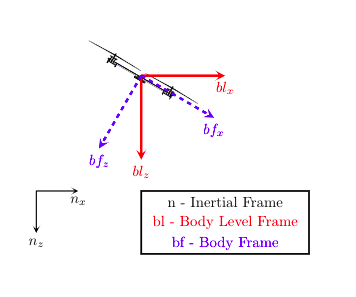
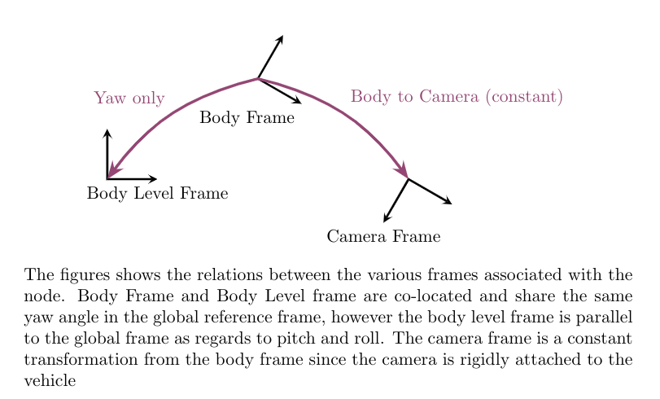

# Position To Velocity

The position_to_velocity node takes a pose message and converts it to velocity in the NED frame, body level frame, and the camera frame. The transform from the body frame to the camera frame is given as a parameter in a YAML file. The node also publishes the associated covariance.
The body level frame, also called the local level frame, is the body frame which is unrolled and unpitched. The figure below will help understand the frames better:






The node currently subscribes only to a [geometry_msgs/PoseStamped](http://docs.ros.org/api/geometry_msgs/html/msg/PoseStamped.html) message type but the code is modular to be able to subscribe to other messages types. To do so, just copy the values into an [Eigen::Affine](https://eigen.tuxfamily.org/dox/group__TutorialGeometry.html) and pass it to the process_msg(...) function.

## Table of Contents
1. [Prerequisites](#prerequisites)
2. [Installation](###installation)
3. [Node Topics](#node-topics)
4. [Parameters](#parameters)
5. [Usage](#wsage)
6. [Comments on Code](#comments-on-code)

## Prerequisites
The following packages are requred depencencies:
```xml
geometry_msgs
roscpp
rospy
std_msgs
tf2_eigen
reef_msgs
```
## Installation
```xml
cd catkin_ws/src
git clone http://192.168.1.101/AVL-Summer-18/position_to_velocity
cd ../ && catkin_make

```
## Node Topics:
The node subscribes to the following messages:
```xml
/pose_stamped [geometry_msgs/PoseStamped]
```
The node publishes the following messages:
```xml
velocity/ned [geometry_msgs/TwistWithCovarianceStamped]
velocity/camera_frame [geometry_msgs/TwistWithCovarianceStamped]
velocity/body_level_frame [geometry_msgs/TwistWithCovarianceStamped]
```

## Parameters
The node depends on the following parameters:

| Parameter        | Function| Default| Type|
|:-------------:|:-------------:|:-----:|:-------:|
| body_to_camera | The transform from body frame to camera frame|  None | Set of double, converted to Eigen::Affine3d |
| convert_to_ned      | Flag to convert from NWU to NED frame      |   False | bool |
| verbose| Flag to print debug messages      |    False | bool |
| alpha      | Parameter for the alpha-beta filter |   1.0 | Double |
| mocap_noise_std | Standard Deviation for the noise |    0.01| Double|
| update_rate      | Update rate in HZ      |   20| Double |


## Usage
The node can be launched using the following lines in a launch file
```html
    <node name="pose_to_vel" pkg="position_to_velocity" type="position_to_velocity_node" output="screen" >
        <rosparam command="load" file="$(find position_to_velocity)/params/basic.yaml" />
    </node>
``` 

It can also be used via a *rosrun* command.

## Comments on Code
The code uses the *std* library to generate random numbers. 


In line 90 you notice that we get the yaw from the current pose from the rotation matrix portion of the homogeneous transformation (*linear() return a Matrix3d which is the rotation matrix). The function *get_yaw* expects a Direction Cosine Matrix which is the inverse of the rotation matrix. Since rotation matrices and DCM are orthonormal matrices, the inverse is the transpose. 
```c++
reef_msgs::get_yaw(current_pose.linear().transpose(), yaw);
```
 Line 101 uses an [alpha-beta filter](https://en.wikipedia.org/wiki/Alpha_beta_filter) to filter out any noise. 

```c++
filtered_velocity_NED.translation() = alpha * velocity_current.translation() - (1-alpha) * velocity_previous.translation();
```